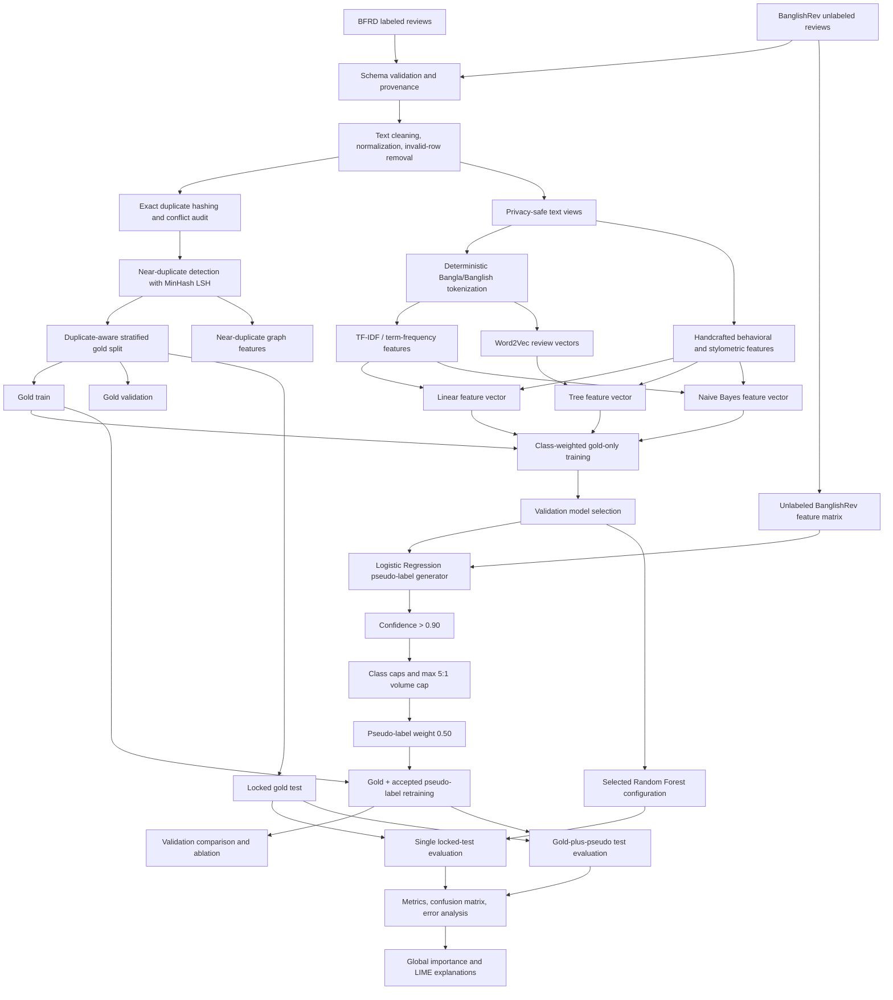

# Explainable Fake Review Detection for Bangla

## IEEE-Style Project Report Specification and Results Record

**Project team:** Syed Abir Hossain; Alim Bin Yeasin; Shuhrid Abrar

> **Purpose of this file.** This is a comprehensive report blueprint and evidence-backed results record for converting the completed project into an IEEE conference-style paper. It is intentionally not a full manuscript. The structure follows a conventional IEEE research-paper order: abstract, introduction, related work, methodology, experiments, results, discussion, limitations, and reproducibility.
>
> **Format assumption.** There is no universally defined “Google XYZ” academic-report format identifiable from the repository. This document therefore uses a clean Markdown/IEEE-compatible structure. It can be moved into IEEE Word or LaTeX later without changing the scientific organization.

---

## 1. Executive Summary

This project develops a resource-conscious, explainable pipeline for detecting fake reviews written in Bangla, Banglish, and code-mixed e-commerce language. The system combines lexical TF–IDF evidence, Word2Vec sentence representations, stylometric and promotional signals, and near-duplicate structure. It addresses the scarcity of labeled Bangla fake-review data through controlled pseudo-labeling on a large unlabeled BanglishRev pool, while preserving a locked gold test set for final evaluation.

The completed run used 9,034 cleaned labeled BFRD reviews and a deterministic 500,000-review BanglishRev sample that became 324,129 clean unlabeled rows after cleaning/deduplication. The gold data were split into 6,321 training, 1,356 validation, and 1,356 locked-test reviews. The selected classifier was a Random Forest using a 25-dimensional Word2Vec representation plus 26 handcrafted features. On the locked test set, the gold-only model achieved macro-F1 **0.9194**, fake-review PR-AUC **0.9213**, fake-review F1 **0.8610**, and accuracy **0.9617**.

The pseudo-labeling experiment is a useful negative result as well as a methodological contribution: the selected Random Forest decreased on validation after expansion and the gold-plus-pseudo model decreased locked-test macro-F1 to **0.9098** and fake-review PR-AUC to **0.9033**. The correct conclusion is that the proposed controls make semi-supervised learning auditable, but pseudo-labeling is not automatically beneficial under this data and model configuration.

### Main measured findings

| Finding | Evidence |
|---|---:|
| Best locked-test condition | Gold-only Random Forest |
| Gold-only test macro-F1 | 0.9194 |
| Gold-only test fake PR-AUC | 0.9213 |
| Gold-plus-pseudo test macro-F1 | 0.9098 |
| Change after pseudo-labeling | −0.0096 macro-F1; −0.0181 fake PR-AUC |
| Validation change for Random Forest | −0.0028 macro-F1; −0.0210 fake PR-AUC |
| LIME cases generated | 110 |

---

## 2. Problem Statement

### 2.1 Problem being solved

Online review platforms need to identify deceptive or artificially generated reviews. For Bangla-language e-commerce reviews, this task is difficult because:

1. labeled fake-review data are scarce and class-imbalanced;
2. reviews contain Bangla, English, Banglish, numerals, emojis, URLs, prices, and informal spelling in the same text;
3. fake reviews can be short, repetitive, promotional, or near-duplicates of other reviews;
4. purely black-box models are difficult for analysts and platform moderators to audit;
5. unlabeled reviews are abundant, but naïve pseudo-labeling can amplify model errors.

### 2.2 Research objective

The objective is to build and evaluate an explainable binary classifier that predicts whether a Bangla/Banglish review is **fake** or **genuine**, while:

- exploiting multiple complementary signals;
- preventing train/test and duplicate leakage;
- handling class imbalance explicitly;
- using unlabeled data only through controlled, weighted pseudo-labeling;
- producing global and local explanations;
- remaining feasible on CPU-oriented Kaggle resources using PySpark.

### 2.3 Research questions

**RQ1.** Do multi-signal representations outperform TF–IDF-only representations?

**RQ2.** Does controlled pseudo-labeling improve performance on held-out labeled data?

**RQ3.** Do near-duplicate graph features provide useful predictive information after duplicate-aware splitting?

**RQ4.** Can the system expose understandable global feature importance and per-review local explanations?

---

## 3. Contributions and Novelty Claim

The contribution should be stated as a system-level contribution rather than claiming a new learning algorithm.

1. **Bangla-specific multi-signal feature fusion.** The pipeline combines sparse lexical features, dense Word2Vec representations, stylometric features, promotional indicators, script/code-mix statistics, and duplicate-structure features in one classical ML system.

2. **Duplicate-aware leakage control.** Exact duplicates are grouped by review hash, near-duplicate groups are detected with MinHash LSH, and the gold split assignment prevents duplicate groups from crossing train, validation, and test partitions.

3. **Auditable semi-supervised learning.** Pseudo-labeling uses confidence thresholds, class-balance caps, a five-to-one total-volume cap relative to gold training data, and reduced pseudo-label weight of 0.5. Every pseudo-labeling decision is recorded in an audit artifact.

4. **Explainability across model families.** The system provides linear coefficients, tree feature importance, error stratification, and LIME explanations for selected test cases.

5. **Evidence against an overly strong semi-supervised claim.** The study reports both validation and locked-test behavior, showing that a small validation gain did not transfer to the final test set. This makes the result reproducible and scientifically honest.

### Recommended novelty wording

> To the best of our knowledge, this work presents an auditable, CPU-feasible Bangla fake-review detection pipeline that unifies multi-signal feature fusion, duplicate-aware splitting, confidence- and class-capped pseudo-labeling, and model explanations in a single experimental protocol. The novelty is in the integrated and controlled methodology, not in proposing a new classifier.

Avoid claiming that pseudo-labeling universally improves performance or that near-duplicate features are independently responsible for the high score; the ablation does not support either claim.

---

## 4. Data Sources and Provenance

### 4.1 Datasets

| Dataset | Role | Recorded source | Recorded size |
|---|---|---|---:|
| BFRD | Gold labeled data | `shawon95/Bengali-Fake-Review-Dataset` | 9,049 raw reviews |
| BanglishRev | Unlabeled auxiliary pool | `BanglishRev/bangla-english-and-code-mixed-ecommerce-review-dataset` | 1,746,943 written reviews scanned |

Recorded dataset revisions:

- BFRD commit: `dc5cfbb420f93742d41053d2bd8f1d5ac3360635`
- BanglishRev commit: `38c97cd4255799359b612bafb721e3c442bc0851`
- Random seed: `42`

### 4.2 Gold-data audit

| Quantity | Value |
|---|---:|
| Raw BFRD rows | 9,049 |
| Raw genuine label 0 | 1,339 |
| Raw fake label 1 | 7,710 |
| Clean BFRD rows | 9,034 |
| Clean genuine | 1,337 |
| Clean fake | 7,697 |
| Conflicting duplicate rows quarantined | 0 |
| Exact/duplicate groups recorded | 8,733 |
| Near-duplicate pairs recorded | 365 |

The labels are highly imbalanced, with fake reviews forming a minority class in the project’s encoding. Accordingly, accuracy is not used as the sole success criterion; macro-F1 and fake-review PR-AUC are emphasized.

### 4.3 Split protocol

| Split | Genuine (0) | Fake (1) | Total |
|---|---:|---:|---:|
| Train | 934 | 5,387 | 6,321 |
| Validation | 201 | 1,155 | 1,356 |
| Locked test | 201 | 1,155 | 1,356 |

The final decision-support artifact confirms the training count as 6,321 rows (934 label-0 and 5,387 label-1). Throughout this report, the project encoding is **label 0 = fake** and **label 1 = genuine**.

The test set is locked before feature fitting. Duplicate groups are not allowed to cross gold splits. All learned transformations used by supervised models are fitted on the gold training split only.

### 4.4 Unlabeled pool sampling

The final-run acquisition notebook requested a deterministic 500,000-row bottom-k SHA-256 sample over the written BanglishRev reviews. After cleaning and deduplication, 324,129 rows remained for the final-run pool described in the notebook audit. Earlier local output archives contain a 100,000-request run yielding 70,471 rows and a 70,150-row preprocessing artifact. These are historical artifacts and must not be mixed with the latest run without confirming the Kaggle manifest.

---

## 5. End-to-End Pipeline

### Pipeline stages

1. **Acquisition and audit:** load pinned dataset revisions; validate schemas, row counts, nulls, labels, and provenance.
2. **Cleaning and privacy processing:** normalize text, remove invalid rows, redact email/phone/URL-like content for safe analytical text, and preserve separate model-text representations.
3. **Duplicate control:** compute exact review hashes; identify near-duplicate groups using token shingles and MinHash LSH; assign duplicate-aware splits.
4. **Preprocessing and EDA:** tokenize Bangla/Banglish text; calculate length, token, script, code-mix, promotional, punctuation, emoji, and metadata-derived signals.
5. **Feature engineering:** fit representations on gold training data and create separate feature vectors for linear, tree, and Naive Bayes models.
6. **Gold-only training:** train several Spark classifiers; use class weights; tune/compare selected configurations using validation data.
7. **Pseudo-labeling:** use a tuned Logistic Regression model on the unlabeled pool; accept only high-confidence predictions; cap class and total volume; down-weight pseudo-labeled examples.
8. **Final evaluation:** evaluate the validation-selected gold-only and expanded configurations once on the locked test set.
9. **Explainability:** generate model-global and prediction-local explanations plus structured error analysis.

---

## 6. Preprocessing and Feature Engineering

### 6.1 Privacy-safe text contract

The preprocessing stage records separate text views so that analysis can be performed without unnecessarily exposing personal or transactional information.

- Excluded source fields: Buyer ID and Images.
- Redacted in safe review: email, phone, and URL patterns.
- Removed from model text: email, phone, URL, price, and mention patterns.
- Tokenization is deterministic and reused by final evaluation/LIME.

### 6.2 Handcrafted features

The reported feature inventory includes:

- `char_length`, `token_count`;
- `codemix_ratio`, Bengali-character count, Latin-character count, digit-character count, other-character count;
- `repeated_char_ratio`;
- URL, email, phone, price, hashtag, mention, exclamation, and emoji counts;
- promotional keyword hits and promotional/emoji presence flags;
- exact duplicate cluster size and exact-duplicate flag;
- near-duplicate degree, similarity, and cluster size;
- presence flags for URL, email, phone, price, promotion, and emoji.

### 6.3 Learned representations

The recorded feature audit reports:

| Representation | Recorded configuration |
|---|---|
| TF–IDF/count vocabulary | 30,000 terms; minimum document frequency 5; Kaggle-safe mode enabled |
| Word2Vec | 25-dimensional vectors |
| Near-duplicate LSH | 3-token shingles, distance threshold 0.30, 3 hash tables, 8,192 hash dimensions |
| Linear vector | 30,026 dimensions |
| Tree vector | 51 dimensions |
| Naive Bayes vector | 30,026 dimensions |

These values are taken from the final `feature_audit.json` and should be cited as the final run configuration.

### 6.4 Feature vectors by model family

- **Logistic Regression and Linear SVC:** TF–IDF concatenated with standardized handcrafted features.
- **Naive Bayes:** non-negative term-frequency features concatenated with non-negative handcrafted features.
- **Random Forest and GBT:** 25-dimensional Word2Vec representation concatenated with raw handcrafted features.
- **Ablation:** TF–IDF-only and linear features without near-duplicate fields.

---

## 7. Models and Training Protocol

The pipeline evaluates Spark ML implementations of:

- Logistic Regression;
- Multinomial Naive Bayes;
- Linear SVC;
- Random Forest;
- Gradient-Boosted Trees;
- Decision Tree and Factorization Machine models in the broader final-run comparison.

Class weights are derived from gold training counts. For the archived gold-training audit:

- fake-label (0) class weight: 3.38383;
- genuine-label (1) class weight: 0.58669;
- Logistic Regression and GBT received focused three-fold cross-validation in the gold-only stage;
- final model selection is based on gold validation, with macro-F1 primary and fake PR-AUC used as a tie-breaker where specified.

### 7.1 Pseudo-label controls

The pseudo-labeling protocol is:

- generator: tuned gold-only Logistic Regression;
- primary confidence threshold: strictly greater than 0.90;
- sensitivity threshold: strictly greater than 0.95;
- pseudo-label source weight: 0.50;
- maximum pseudo/gold ratio: 5.0;
- maximum class-share control: 80%;
- class-aware caps are applied after confidence filtering;
- pseudo-labels never enter validation or test labels.

In the final pseudo-label audit, the primary run accepted 304,667 candidates before capping and 31,605 after capping: 25,284 label-1 (genuine) and 6,321 label-0 (fake). The sensitivity thresholds also produced 31,605 accepted examples after the same class caps. Pseudo-labels were assigned a source weight of 0.50.

---

## 8. Results

### 8.1 Gold-only validation comparison

| Model | Macro-F1 | Fake PR-AUC | Fake F1 | Accuracy |
|---|---:|---:|---:|---:|
| Random Forest | 0.9252 | 0.9235 | 0.8710 | 0.9646 |
| GBT | 0.9074 | 0.9173 | 0.8421 | 0.9535 |
| Logistic Regression | 0.9094 | 0.8899 | 0.8446 | 0.9558 |
| Linear SVC | 0.7758 | 0.6677 | 0.6097 | 0.8990 |
| Naive Bayes | 0.7139 | 0.5397 | 0.5331 | 0.8282 |
| Decision Tree | 0.8650 | 0.8616 | 0.7735 | 0.9270 |
| Factorization Machine | 0.6673 | 0.3455 | 0.4267 | 0.8414 |

The final selection manifest identifies Random Forest as the selected model for both the gold and expanded configurations. It has the strongest gold-only validation macro-F1 (0.9252), fake PR-AUC (0.9235), fake F1 (0.8710), and accuracy (0.9646) among the compared models.

### 8.2 Gold versus expanded validation

| Model | Gold macro-F1 | Expanded macro-F1 | Δ macro-F1 | Gold fake PR-AUC | Expanded fake PR-AUC | Δ fake PR-AUC |
|---|---:|---:|---:|---:|---:|---:|
| Random Forest | 0.9252 | 0.9224 | −0.0028 | 0.9235 | 0.9025 | −0.0210 |
| GBT | 0.9074 | 0.9042 | −0.0033 | 0.9173 | 0.8984 | −0.0189 |
| Logistic Regression | 0.9094 | 0.9078 | −0.0016 | 0.8899 | 0.8843 | −0.0056 |
| Linear SVC | 0.7758 | 0.8786 | +0.1028 | 0.6677 | 0.8590 | +0.1914 |
| Naive Bayes | 0.7139 | 0.7501 | +0.0362 | 0.5397 | 0.5592 | +0.0195 |
| Decision Tree | 0.8650 | 0.8690 | +0.0040 | 0.8616 | 0.8630 | +0.0014 |
| Factorization Machine | 0.6673 | 0.6597 | −0.0077 | 0.3455 | 0.3609 | +0.0154 |

These validation results motivated carrying the selected Random Forest into the locked-test comparison. They do not establish generalization improvement by themselves.

### 8.3 Locked-test results

The test set contains 1,356 reviews: 201 fake (label 0) and 1,155 genuine (label 1). The two configurations were scored once on this locked gold test split.

| Condition | Macro-F1 | Macro precision | Macro recall | Accuracy | Fake PR-AUC | Fake ROC-AUC | Fake precision | Fake recall | Fake F1 |
|---|---:|---:|---:|---:|---:|---:|---:|---:|---:|
| Gold-only Random Forest | **0.9194** | 0.9484 | 0.8953 | **0.9617** | **0.9213** | 0.9643 | 0.9306 | 0.8010 | **0.8610** |
| Gold + pseudo Random Forest | 0.9098 | 0.9498 | 0.8788 | 0.9580 | 0.9033 | 0.9572 | 0.9390 | 0.7662 | 0.8438 |
| Change | −0.0096 | +0.0014 | −0.0165 | −0.0037 | −0.0181 | −0.0071 | +0.0084 | −0.0348 | −0.0171 |

Confusion matrices use rows as true labels and columns as predicted labels, with label 0 = fake and label 1 = genuine:

- Gold-only: `[[161, 40], [12, 1143]]`
- Gold + pseudo: `[[154, 47], [10, 1145]]`

Interpretation: pseudo-labeling caused 7 additional fake reviews to be missed, while reducing false positives by 2. This trade-off lowered fake-review recall from 0.8010 to 0.7662 and did not justify expansion as the default training strategy.

### 8.4 Feature ablation

| Condition | Feature set | Macro-F1 | Fake PR-AUC | Fake F1 |
|---|---|---:|---:|---:|
| Gold | Full | 0.9094 | 0.8899 | 0.8446 |
| Gold | TF–IDF only | 0.7383 | 0.5919 | 0.5594 |
| Gold | Without near-duplicate features | 0.9107 | 0.8901 | 0.8468 |
| Expanded | Full | 0.9078 | 0.8843 | 0.8413 |
| Expanded | TF–IDF only | 0.7240 | 0.5938 | 0.5551 |
| Expanded | Without near-duplicate features | 0.9078 | 0.8843 | 0.8413 |

The strongest supported conclusion is that the combined feature design substantially outperforms TF–IDF alone. The current ablation does not demonstrate a measurable benefit from near-duplicate features in the Logistic Regression validation setting; they should be described as a principled signal and safety/audit mechanism, not as a proven dominant feature source.

### 8.5 Error analysis

The final decision-support output reports 1,299 correct predictions, 47 false negatives, and 10 false positives for the expanded test condition. Relative to correct cases:

| Error group | Rows | Mean chars | Mean tokens | Mean code-mix | Mean promotional hits | Mean near-duplicate degree |
|---|---:|---:|---:|---:|---:|---:|
| Correct | 1,299 | 674.71 | 101.51 | 0.1442 | 0.3788 | not available |
| False negative | 47 | 450.43 | 69.02 | 0.1327 | 0.7234 | not available |
| False positive | 10 | 746.30 | 118.60 | 0.1773 | 1.0000 | not available |

The false-negative group is shorter on average and has more promotional hits, suggesting that concise promotional fake reviews remain difficult. False positives are longer and also promotional, indicating that legitimate promotional language can resemble deceptive-review signals.

### 8.6 Decision-support outputs

The final PySpark SQL notebook was executed against the saved feature and evaluation artifacts and produced six operational tables under `Final Output/decision_support_outputs/`:

| Output | Final evidence | Decision use |
|---|---|---|
| `class_balance` | 6,321 train; 1,356 validation; 1,356 test; test label-0/label-1 split 201/1,155 | Justifies class-aware metrics and weighting |
| `test_decision_comparison` | Gold-only outperforms gold-plus-pseudo on macro-F1, accuracy, fake PR-AUC, fake recall, and fake F1 | Retain gold-only as the safer default |
| `human_review_queue` | 1,356 ranked test cases using normalized fake-risk scores from Random Forest raw class votes | Prioritize analyst review; do not auto-enforce |
| `error_profile` | False negatives: mean 450.43 characters, 69.02 tokens, 0.7234 promotional hits | Collect more short promotional examples |
| `duplicate_exposure` | 4 exact-duplicate rows; mean exact cluster size 1.0029; near-duplicate degree unavailable in this saved test feature view | Keep duplicate auditing and leakage controls |
| `drift_indicators` | Train/validation/test means are close for length, token count, code-mix, promotion, emoji, and promo flags | No large split-level shift is indicated; continue monitoring |

The queue is an analytics artifact for investigation prioritization. It is not evidence that a review or seller is fraudulent, and the stored label column is used only for retrospective test analysis.

---

## 9. Explainability and Interpretability

### 9.1 Global explanations

The final artifacts include:

- Logistic Regression coefficient table;
- Random Forest feature-importance table;
- GBT feature-importance table;
- test comparison and confusion-matrix plots;
- error-analysis CSV and plot.

The archived Random Forest importance ranking is dominated by `emoji_count` and `has_emoji`, followed by Word2Vec dimensions, `has_promo`, Bengali character count, and `promo_keyword_hits`. This is useful for analysis but should not be interpreted causally: tree importance can be biased by correlated features, and Word2Vec dimensions are latent rather than human-semantic labels.

### 9.2 Local explanations

LIME explanations were generated for 110 cases, including model-selected fake-domain cases and locked-test error/correctness examples. The artifact records the review hash, true label where available, predicted label, correctness where available, influential terms, and model probability note. For privacy, the report should show terms only when publication approval permits; otherwise show hashed case IDs and aggregate patterns.

Observed local-error patterns include promotional strings such as offer/Buy-one-get-one expressions and mixed Bangla/English token fragments. These examples should be presented as illustrative model evidence, not as universal linguistic rules.

### 9.3 Explanation caveats

- A Random Forest prediction is not directly explained by a single linear coefficient.
- LIME is a local surrogate explanation and can vary with its perturbation sample.
- Feature importance is association, not causation.
- Bangla tokenization can fragment Unicode text into short character-like units; this is visible in some LIME outputs and should be discussed as a limitation.

---

## 10. Leakage, Validity, and Reproducibility Controls

The experiment implements the following controls:

- test split created before supervised feature fitting;
- learned vectorizers, IDF, Word2Vec, scalers, and MinHash models fit within the documented training scope;
- duplicate-aware gold split assignment;
- validation used for model selection and pseudo-label configuration comparison;
- pseudo-labels excluded from validation and test labels;
- final test scored once for the gold-only and gold-plus-pseudo conditions;
- source commit hashes and deterministic seed recorded;
- pseudo-label audit stores confidence threshold, class counts, caps, sample weight, and validation comparison.

Before publication, verify the exact fit scope in the latest `feature_audit.json`, because the archived audit says “global unlabeled corpus” for some unsupervised transformations while the methodological intent is to prevent supervised leakage. The paper should state precisely which transformations were fit on gold training only and which, if any, were fit transductively.

---

## 11. Limitations and Threats to Validity

1. **Single gold source.** BFRD may encode source- or collection-specific artifacts; cross-dataset external validation is not included.
2. **Label semantics.** The project inherits the original dataset’s fake/genuine annotation process and its possible annotation bias.
3. **Class imbalance.** The fake class is a minority in raw counts, so macro metrics and PR-AUC are essential; accuracy alone would be misleading.
4. **Unlabeled-domain mismatch.** BanglishRev is an auxiliary review corpus, not a verified fake/genuine sample. Its distribution may differ from BFRD.
5. **Pseudo-label confirmation bias.** High confidence is not equivalent to correctness; the locked-test degradation demonstrates this risk.
6. **Near-duplicate features.** The current ablation shows no practical gain for the tested Logistic Regression configuration.
7. **Interpretability of embeddings.** Word2Vec dimensions do not have direct human-readable meanings.
8. **Tokenizer limitations.** Informal Bangla, spelling variation, emoji, and code-mixing may be fragmented or normalized imperfectly.
9. **Run-version drift.** The repository contains multiple historical output archives. Final paper numbers must be tied to one Kaggle run ID and one artifact manifest.
10. **No statistical uncertainty.** The current report gives point estimates only. A conference version should add bootstrap confidence intervals or repeated split analysis if computationally feasible.

---

## 12. Recommended Paper Structure

### I. Introduction

Introduce deceptive reviews, the Bangla/Banglish setting, low-resource constraints, explainability needs, and the paper’s contributions.

### II. Related Work

Discuss opinion-spam detection, Bangla NLP, code-mixed text classification, near-duplicate detection, pseudo-labeling, and explainable ML. Cite the project’s existing sources, then add the most recent peer-reviewed comparisons before submission.

### III. Data and Problem Formulation

Define binary label (y \in \{0,1\}), the gold dataset, unlabeled pool, duplicate policy, class imbalance, and train/validation/test protocol.

### IV. Proposed Method

Present preprocessing, privacy-safe text views, handcrafted signals, TF–IDF, Word2Vec, MinHash LSH, feature fusion, class weighting, model families, and controlled pseudo-labeling.

### V. Experimental Design

State hardware/runtime context, Spark configuration, seed, hyperparameter search, evaluation metrics, ablations, and locked-test policy.

### VI. Results and Analysis

Include validation comparison, final test table, ablation table, confusion matrices, error analysis, and pseudo-label sensitivity.

### VII. Explainability

Include global feature importance, coefficient analysis, LIME examples, and explanation caveats.

### VIII. Limitations and Ethics

Discuss false accusations, human review requirements, privacy, dataset bias, model drift, and the fact that the detector should assist moderation rather than make irreversible decisions autonomously.

### IX. Conclusion

Conclude that the multi-signal explainable system performs strongly on the recorded BFRD test split, but that controlled pseudo-labeling did not improve the locked-test result in this run.

---

## 13. Artifacts and Reproduction Checklist

### Repository notebooks

- `Final Run/dataaudit.ipynb`
- `Final Run/preprocess.ipynb`
- `Final Run/featureengi.ipynb`
- `Final Run/goldtrain.ipynb`
- `Final Run/pseudol.ipynb`
- `Final Run/evaluate.ipynb`

### Expected Kaggle artifacts

- `audit/acquisition_audit.json`
- `audit/preprocessing_audit.json`
- `audit/feature_audit.json`
- `audit/gold_training_audit.json`
- `audit/pseudo_label_audit.json`
- `audit/final_evaluation_audit.json`
- `results/gold_validation_metrics.csv`
- `results/gold_vs_expanded_validation.csv`
- `results/feature_ablation_validation.csv`
- `results/test_results_final.csv`
- `report/final_summary.json`
- `report/error_analysis.csv`
- `report/logistic_coefficients.csv`
- `report/random_forest_feature_importance.csv`
- `report/gbt_feature_importance.csv`
- `report/lime_explanations.json`
- `report/confusion_matrices.png`
- `report/test_comparison.png`
- `report/error_analysis.png`
- `decision_support_outputs/class_balance/`
- `decision_support_outputs/test_decision_comparison/`
- `decision_support_outputs/human_review_queue/`
- `decision_support_outputs/error_profile/`
- `decision_support_outputs/duplicate_exposure/`
- `decision_support_outputs/drift_indicators/`

### What should be downloaded from Kaggle before final submission

For this draft, the executed notebook outputs and local ZIP archives were sufficient. For the final paper package, download the latest run’s complete `audit/`, `results/`, and `report/` folders, plus the run metadata or Kaggle notebook version. This is necessary to:

- resolve the 500,000-sample versus historical 100,000-sample discrepancy;
- verify final feature dimensions and safe-mode settings;
- confirm that all tables and plots correspond to the same run;
- preserve the exact final model-selection manifest;
- avoid citing stale local archives as the latest experiment.

Do not rerun the pipeline merely to generate this Markdown file. Downloading the latest artifacts is the recommended final verification step.

---

## 14. Suggested Abstract for the Future IEEE Paper

> Fake-review detection for Bangla and Banglish e-commerce text is challenging because labeled data are limited, class distributions are imbalanced, and reviews combine multiple scripts and informal signals. We present an explainable, CPU-feasible PySpark pipeline that fuses TF–IDF, 25-dimensional Word2Vec, stylometric, promotional, and duplicate-audit features. The system uses duplicate-aware splitting, class-weighted supervised learning, and confidence- and class-capped pseudo-labeling on an unlabeled BanglishRev pool. On a locked BFRD test set, the selected Random Forest achieved a macro-F1 of 0.9194, fake-review PR-AUC of 0.9213, and accuracy of 0.9617 using gold labels only. Pseudo-label expansion reduced locked-test macro-F1 to 0.9098 and fake-review PR-AUC to 0.9033, demonstrating that confidence filtering does not eliminate domain-shift and confirmation-bias risks. Global feature importance, coefficient analysis, error stratification, LIME explanations for 110 cases, and PySpark SQL decision-support tables provide auditability. The results support multi-signal explainable detection as a human-in-the-loop screening system rather than an autonomous enforcement mechanism.

---

## 15. References Already Declared by the Project

Use the exact bibliographic metadata and IEEE citation style during manuscript preparation.

1. Shahariar et al., “Bengali fake reviews: A benchmark dataset and detection system,” *Neurocomputing*, 2024.
2. Shamael et al., “BanglishRev: A Large-Scale Bangla-English and Code-mixed Dataset,” arXiv:2412.13161, 2024.
3. N. Jindal and B. Liu, “Opinion spam and analysis,” *WSDM*, 2008.
4. M. Ott et al., “Finding deceptive opinion spam by any stretch of the imagination,” *ACL-HLT*, 2011.
5. D.-H. Lee, “Pseudo-label: The simple and efficient semi-supervised learning method for deep neural networks,” ICML Workshop, 2013.
6. M. T. Ribeiro, S. Singh, and C. Guestrin, “Why should I trust you? Explaining the predictions of any classifier,” *KDD*, 2016.

Add current peer-reviewed baselines and the precise dataset citations before conference submission.

---

## 16. Final Author Checklist

- [ ] Replace historical-artifact wording with one verified Kaggle run ID.
- [ ] Confirm the exact latest BanglishRev sample size and clean-row count.
- [ ] Confirm final feature dimensions and whether Kaggle-safe mode was enabled.
- [ ] Resolve the one-row gold-training audit discrepancy.
- [ ] Add confidence intervals or repeated-run variability if possible.
- [ ] Add a table of exact hyperparameters from the final model manifests.
- [ ] Include the final pipeline diagram as a vector figure in the IEEE manuscript.
- [ ] State that pseudo-labeling decreased locked-test performance in this run.
- [ ] Review all LIME examples for privacy and publication permission.
- [ ] Add ethics, false-positive impact, and human-in-the-loop deployment safeguards.
